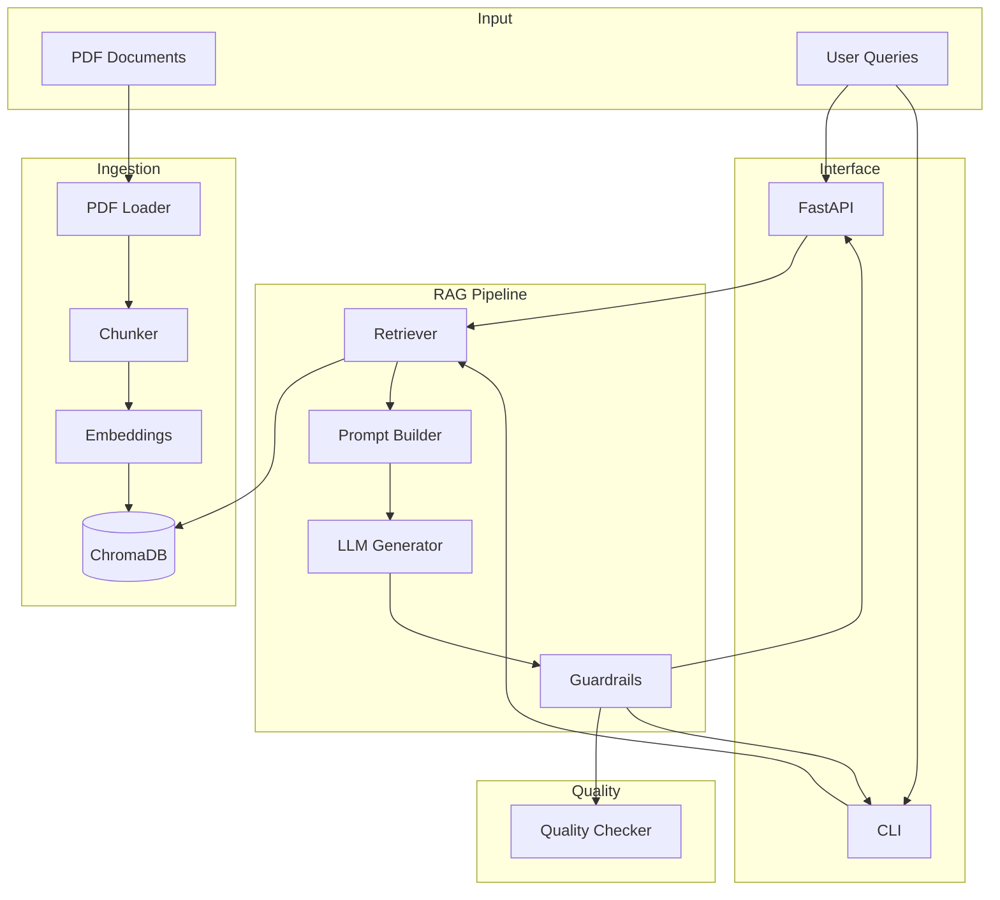
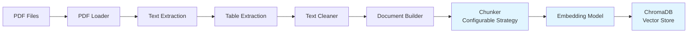
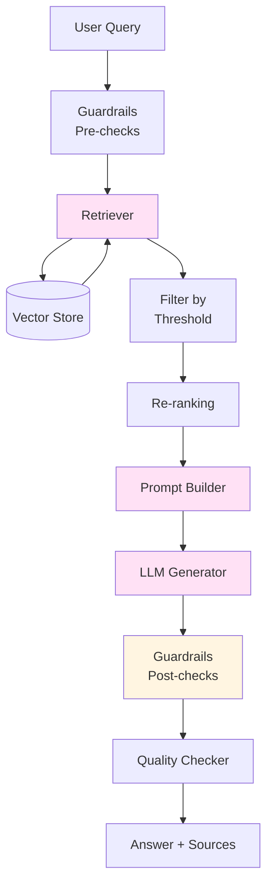
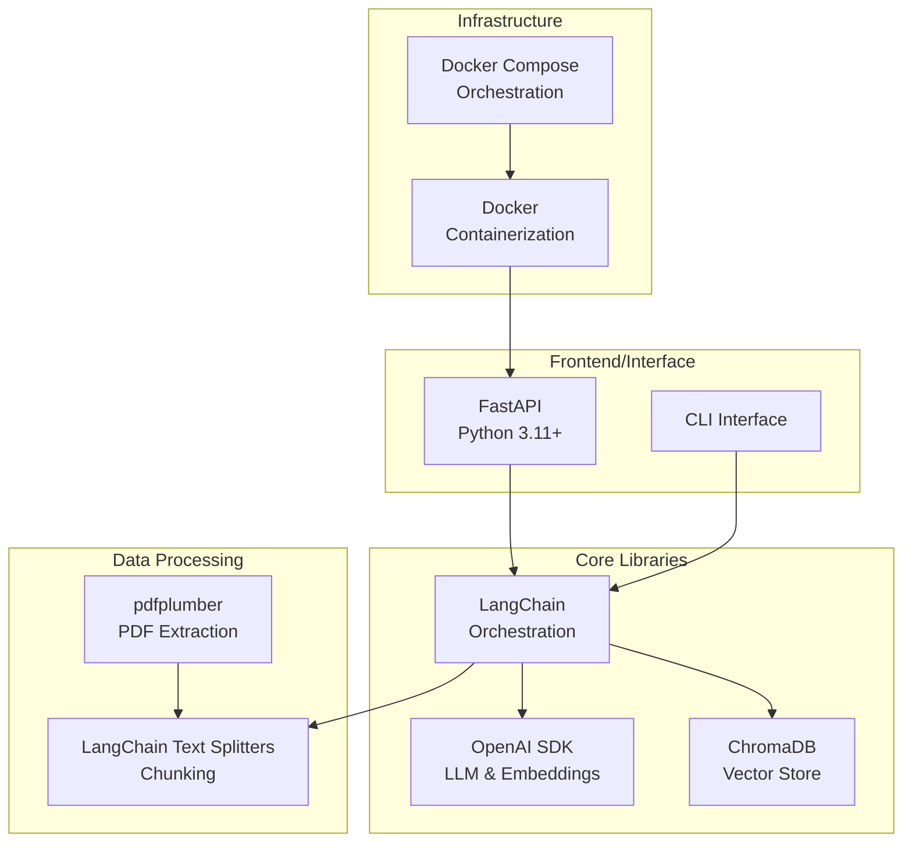
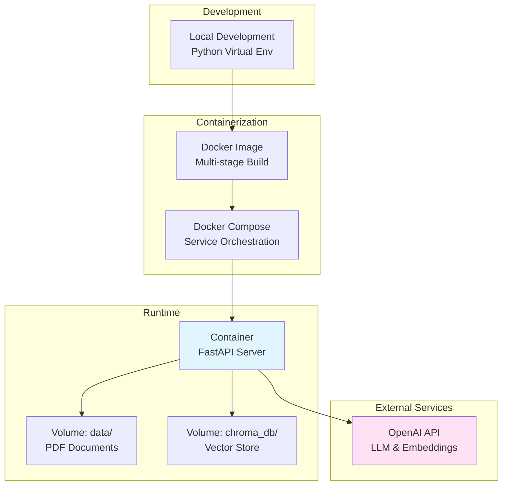

# RAG Lab Tests - Conversational AI Assistant

A production-ready RAG (Retrieval-Augmented Generation) system for answering questions about laboratory test results from PDF documents.

## 🎯 Project Overview

This project implements a "Chat with Your Docs" application that can answer questions about medical laboratory test information from a collection of PDF documents. It demonstrates production-ready AI system engineering with comprehensive RAG implementation, guardrails, quality controls, and testing.

## 🏗️ System Architecture

### Architecture Diagram



### Architecture Overview

The system follows a modular, layered architecture with clear separation of concerns:

#### **Layer 1: Input Layer**
- **PDF Documents**: Source documents stored in `data/` directory
- **User Queries**: Questions submitted via API or CLI

#### **Layer 2: Ingestion Pipeline** (`app/ingestion/`)
- **PDF Loader** (`loader.py`): Extracts text and tables from PDF files
- **Text Cleaner**: Normalizes and cleans extracted text
- **Document Chunker** (`chunker.py`): Splits documents into chunks using configurable strategy
- **Embedding Model**: Converts chunks to vector embeddings
- **Vector Store** (`indexer.py`): Persists embeddings in ChromaDB

#### **Layer 3: RAG System** (`app/rag/`)
- **Retriever** (`retriever.py`): 
  - Retrieves relevant chunks using similarity search
  - Applies similarity threshold filtering
  - Implements re-ranking for better relevance
- **Prompt Builder** (`prompt.py`):
  - Constructs prompts with context
  - Manages token limits and truncation
  - Handles optional few-shot examples
- **LLM Generator** (`generator.py`):
  - Generates answers using OpenAI GPT models
  - Manages context window and max tokens (1000)
  - Supports streaming responses
- **Guardrails** (`guardrails.py`):
  - Relevance checking
  - Ambiguous query detection
  - Medical emergency detection
  - Source attribution
  - Response validation

#### **Layer 4: API Layer**
- **FastAPI Server** (`api.py`): RESTful API with health checks
- **CLI Interface** (`main.py`): Command-line interface for interactive use

#### **Layer 5: Quality & Evaluation** (`app/eval/`)
- **Quality Checker** (`quality_checks.py`):
  - Answer quality metrics
  - Retrieval quality evaluation
  - Completeness checks

### Data Flow

1. **Ingestion Flow:**
   ```
   PDF → Loader → Cleaner → Chunker → Embeddings → Vector Store
   ```

2. **Query Flow:**
   ```
   User Query → Retriever → Vector Store → Context Documents
   → Prompt Builder → LLM → Guardrails → Quality Check → Response
   ```

## 🔧 Technical Architecture & Implementation Decisions

### System Design Principles

1. **Modularity**: Clear separation of concerns with dedicated modules for each component
2. **Configurability**: All key parameters configurable via `app/config.py`
3. **Extensibility**: Easy to add new chunking strategies, retrieval methods, or LLM providers
4. **Testability**: Comprehensive test coverage with unit and integration tests
5. **Production-Ready**: Docker containerization, health checks, error handling

### Component Architecture

#### Ingestion Pipeline Architecture



#### RAG Pipeline Architecture



## 🔧 Implementation Decisions

### Vector Indexing Strategy

**Chunking Approach:**
- **Chunk Size:** 600 characters (configurable in `app/config.py`)
- **Overlap:** 100 characters (configurable)
- **Strategy:** Configurable chunking strategy (default: `recursive_character`)
  - **Recursive Character Splitter:** Hierarchical separators (paragraphs → lines → sentences)
  - **Character Splitter:** Single separator-based splitting
- **Separators:** Configurable list of separators for recursive strategy

**Configuration:**
All chunking parameters are configurable via `app/config.py`:
- `CHUNKING_STRATEGY`: Strategy selection (`recursive_character` or `character`)
- `CHUNK_SIZE`: Target chunk size in characters
- `CHUNK_OVERLAP`: Overlap between chunks
- `CHUNK_SEPARATORS`: List of separators for hierarchical splitting

**Rationale:**
- 600 characters balances context preservation with retrieval precision
- 100-character overlap ensures continuity across chunk boundaries
- Hierarchical separators (paragraphs → lines → sentences) preserve semantic structure
- Table rows are preserved with " | " separator for structured data
- Configurable strategy allows experimentation and optimization for different document types

### Embedding Model & LLM Selection

**Embedding Model:** `text-embedding-3-small`
- **Reasoning:**
  - Cost-effective for production use
  - 1536 dimensions provide good semantic representation
  - Fast inference latency
  - Good performance on medical/technical text

**LLM:** `gpt-4o-mini`
- **Reasoning:**
  - Excellent cost/performance balance
  - Low latency for real-time responses
  - Sufficient context window (128k tokens)
  - Good instruction following
  - Temperature: 0.1 for factual, consistent responses
  - Max tokens: 1000 (configurable in `app/config.py`)

### Retrieval Approach

**Strategy:**
- **Top-K:** 15 documents (configurable, default in `app/config.py`)
- **Similarity Threshold:** 0.3 (filters low-relevance results, optimized for L2 distance conversion)
- **Re-ranking:** Enabled (combines similarity + content length)

**Implementation:**
1. Retrieve 2x top_k initially for filtering buffer
2. Convert distance scores to similarity scores
3. Filter by similarity threshold
4. Optional re-ranking: 70% similarity + 30% content length
5. Return top-k most relevant documents

**Rationale:**
- Similarity threshold prevents low-quality context
- Re-ranking improves answer quality by preferring detailed chunks
- Top-k=15 captures range information that may be ranked lower

### Prompt Engineering

**System Prompt:**
- Defines role as medical lab test assistant
- Emphasizes accuracy and source-based answers
- Includes safety disclaimers
- Specifies source attribution requirements

**Context Management:**
- Maximum context tokens: 3000
- Token estimation: ~4 characters per token
- Truncation strategy: Prioritize earlier, more relevant chunks
- Source attribution included in prompt

**Few-Shot Examples:**
- Optional few-shot examples for better instruction following
- Examples demonstrate expected answer format and style

### Context Management

**Token Counting:**
- Character-based estimation (1 token ≈ 4 characters)
- Tracks context usage across documents
- Truncates when approaching limits

**Truncation Strategy:**
- Prioritize documents by similarity score
- Include full documents when possible
- Partial document inclusion if meaningful space remains (>100 tokens)
- Metadata flag for truncated documents

### Guardrails

**Implemented Safeguards:**

1. **Relevance Checking:**
   - Minimum similarity score: 0.5
   - Filters irrelevant results
   - Provides fallback responses

2. **Ambiguous Query Detection:**
   - Detects overly short queries
   - Identifies vague patterns ("what", "how", etc.)
   - Suggests query improvements

3. **Medical Emergency Detection:**
   - Keyword-based detection
   - Provides emergency service guidance
   - Emphasizes general information only

4. **Source Attribution:**
   - Automatic source citation
   - Includes document metadata
   - Builds user trust

5. **Response Validation:**
   - Checks answer completeness
   - Detects error patterns
   - Validates disclaimer presence

### Quality Controls

**Evaluation Metrics:**

The `QualityChecker` class (`app/eval/quality_checks.py`) provides comprehensive evaluation of RAG system performance through the `run_full_evaluation()` method. The evaluation returns a complete structure with all metrics:

```json
{
    "answer_quality": {
        "answer_length": int,
        "word_count": int,
        "has_sources": bool,
        "num_sources": int,
        "avg_similarity": float,
        "completeness_score": float,
        "relevance_score": float,
        "quality_score": float
    },
    "completeness": {
        "is_complete": bool,
        "is_incomplete": bool,
        "is_too_short": bool,
        "has_question_word": bool
    },
    "retrieval_quality": {
        "num_retrieved": int,
        "expected_num": int,
        "retrieval_rate": float,
        "avg_similarity": float,
        "min_similarity": float,
        "max_similarity": float,
        "retrieval_quality_score": float
    },
    "overall_score": float
}
```

**Metric Descriptions:**

- **answer_quality.answer_length**: Character count of the generated answer
- **answer_quality.word_count**: Word count of the generated answer
- **answer_quality.has_sources**: Boolean indicating if context documents are available
- **answer_quality.num_sources**: Number of retrieved context documents
- **answer_quality.avg_similarity**: Average similarity score (0-1) across all context documents
- **answer_quality.completeness_score**: Query word coverage ratio (0-1), calculated as common words between query and answer divided by query words
- **answer_quality.relevance_score**: Maximum similarity score (0-1) from context documents
- **answer_quality.quality_score**: Overall answer quality (0-1), calculated as: 30% completeness_score + 40% relevance_score + 20% source availability + 10% length appropriateness (normalized word count, max 100 words)

- **completeness.is_complete**: Boolean indicating if answer is complete and addresses the query
- **completeness.is_incomplete**: Boolean indicating if incomplete indicators were detected ("i don't know", "i cannot", "i'm not able", "not available", "couldn't find")
- **completeness.is_too_short**: Boolean indicating if answer has fewer than 15 words
- **completeness.has_question_word**: Boolean indicating if query contains question words ("what", "how", "why", "when", "where", "who")

- **retrieval_quality.num_retrieved**: Number of documents retrieved
- **retrieval_quality.expected_num**: Expected number of documents (top_k parameter)
- **retrieval_quality.retrieval_rate**: Ratio of retrieved to expected documents (0-1)
- **retrieval_quality.avg_similarity**: Average similarity score (0-1) across retrieved documents
- **retrieval_quality.min_similarity**: Minimum similarity score (0-1) among retrieved documents
- **retrieval_quality.max_similarity**: Maximum similarity score (0-1) among retrieved documents
- **retrieval_quality.retrieval_quality_score**: Overall retrieval quality (0-1), calculated as: 50% retrieval_rate + 50% avg_similarity

- **overall_score**: Comprehensive system score (0-1), calculated as: 40% answer_quality.quality_score + 30% completeness.is_complete (binary) + 30% retrieval_quality.retrieval_quality_score

**Actual Evaluation Results:**

**Example 1: Low Score (Short Answer)**

Query: "What is cholesterol?"  
Answer: "Cholesterol is a waxy substance found in your blood."  
Retrieved documents: 2 (similarity scores: 0.8, 0.75), expected: 5

```json
{
    "answer_quality": {
        "answer_length": 54,
        "word_count": 9,
        "has_sources": true,
        "num_sources": 2,
        "avg_similarity": 0.775,
        "completeness_score": 0.667,
        "relevance_score": 0.8,
        "quality_score": 0.729
    },
    "completeness": {
        "is_complete": false,
        "is_incomplete": false,
        "is_too_short": true,
        "has_question_word": true
    },
    "retrieval_quality": {
        "num_retrieved": 2,
        "expected_num": 5,
        "retrieval_rate": 0.4,
        "avg_similarity": 0.775,
        "min_similarity": 0.75,
        "max_similarity": 0.8,
        "retrieval_quality_score": 0.588
    },
    "overall_score": 0.468
}
```

**Score Breakdown:**
- **quality_score (0.729)**: 30% × 0.667 (completeness) + 40% × 0.8 (relevance) + 20% × 1.0 (sources) + 10% × 0.09 (length) = 0.729
- **retrieval_quality_score (0.588)**: 50% × 0.4 (retrieval_rate) + 50% × 0.775 (avg_similarity) = 0.588
- **overall_score (0.468)**: 40% × 0.729 + 30% × 0.0 (is_complete=false) + 30% × 0.588 = 0.468

**Example 2: High Score (Complete Answer)**

Query: "What are normal cholesterol levels?"  
Answer: "Normal cholesterol levels typically include total cholesterol below 200 mg/dL, LDL cholesterol below 100 mg/dL, and HDL cholesterol above 60 mg/dL. These values help assess cardiovascular health risk and guide treatment decisions."  
Retrieved documents: 5 (similarity scores: 0.88, 0.85, 0.82, 0.80, 0.78), expected: 5

```json
{
    "answer_quality": {
        "answer_length": 214,
        "word_count": 35,
        "has_sources": true,
        "num_sources": 5,
        "avg_similarity": 0.826,
        "completeness_score": 0.875,
        "relevance_score": 0.88,
        "quality_score": 0.866
    },
    "completeness": {
        "is_complete": true,
        "is_incomplete": false,
        "is_too_short": false,
        "has_question_word": true
    },
    "retrieval_quality": {
        "num_retrieved": 5,
        "expected_num": 5,
        "retrieval_rate": 1.0,
        "avg_similarity": 0.826,
        "min_similarity": 0.78,
        "max_similarity": 0.88,
        "retrieval_quality_score": 0.913
    },
    "overall_score": 0.860
}
```

**Score Breakdown:**
- **quality_score (0.866)**: 30% × 0.875 (completeness) + 40% × 0.88 (relevance) + 20% × 1.0 (sources) + 10% × 0.35 (length) = 0.866
- **retrieval_quality_score (0.913)**: 50% × 1.0 (retrieval_rate) + 50% × 0.826 (avg_similarity) = 0.913
- **overall_score (0.860)**: 40% × 0.866 + 30% × 1.0 (is_complete=true) + 30% × 0.913 = 0.860

**Why Example 2 achieves a higher overall_score (0.860 > 0.79):**

1. **Answer meets completeness requirement**: 35 words (exceeds 15-word minimum), so `is_complete = true`, contributing the full 30% (0.3) instead of 0.0
2. **Higher quality_score (0.866)**: Better completeness_score (0.875), higher relevance_score (0.88), and good length (35 words)
3. **Higher retrieval_quality_score (0.913)**: Perfect retrieval_rate (1.0) with all 5 expected documents retrieved, plus high average similarity (0.826)
4. **All components optimized**: Each component (answer quality, completeness, retrieval quality) performs well, resulting in an overall_score of 0.860

*Note: These scores are based on evaluation with sample test data. Actual scores will vary based on query complexity, answer quality, and retrieved document relevance.*

## 🚀 Getting Started

### Prerequisites

- Python 3.11+
- OpenAI API key
- Docker and Docker Compose (optional)

### Installation

1. **Clone the repository:**
```bash
git clone <repository-url>
cd RAG_Lab_Tests
```

2. **Create virtual environment:**
```bash
python -m venv .venv
source .venv/bin/activate  # On Windows: .venv\Scripts\activate
```

3. **Install dependencies:**
```bash
pip install -r requirements.txt
```

4. **Set up environment variables:**
```bash
# Create .env file
echo "OPENAI_API_KEY=your-api-key-here" > .env
```

### Usage

#### 1. Ingest Documents

```bash
python -m app.main --ingest
```

This will:
- Extract text from PDFs in `data/` directory
- Chunk documents with metadata
- Build and persist ChromaDB vector store

#### 2. Run CLI Chat

```bash
python -m app.main --chat
```

Interactive command-line interface for asking questions.

#### 3. Run API Server

```bash
python -m app.main --api
```

API will be available at `http://localhost:8000`

**API Endpoints:**
- `GET /health` - Health check
- `POST /chat` - Chat endpoint
- `GET /docs` - API documentation (Swagger UI)

**Example API Request:**
```bash
curl -X POST "http://localhost:8000/chat" \
  -H "Content-Type: application/json" \
  -d '{"query": "What is normal cholesterol?", "top_k": 15}'
```

#### 4. Docker Deployment

```bash
# Build and run with docker-compose
docker-compose up --build

# Or build manually
docker build -t rag-lab-tests .
docker run -p 8000:8000 --env-file .env rag-lab-tests
```

## 🧪 Testing

### Run Tests

```bash
# Run all tests
pytest

# Run with coverage
pytest --cov=app --cov-report=html

# Run specific test file
pytest tests/test_retriever.py

# Run integration tests (requires vector store)
pytest tests/test_integration.py
```

### Test Coverage

- **Unit Tests:** Retriever, guardrails, quality checks
- **Integration Tests:** End-to-end retrieval and generation
- **API Tests:** Health checks and chat endpoints

### Technology Stack



### Deployment Architecture



### Data Flow Architecture

**Ingestion Flow:**
```
PDF Documents → Loader → Cleaner → Chunker → Embeddings → Vector Store
     ↓            ↓         ↓         ↓          ↓            ↓
  [data/]    [extract]  [normalize] [split]  [encode]    [persist]
```

**Query Flow:**
```
User Query → API/CLI → Retriever → Vector Store → Context
     ↓          ↓          ↓            ↓            ↓
  [input]   [receive]  [search]    [retrieve]   [filter]
     ↓
  Prompt Builder → LLM → Guardrails → Quality Check → Response
     ↓              ↓         ↓            ↓            ↓
  [construct]   [generate] [validate]  [evaluate]   [return]
```

## 📁 Project Structure

```
RAG_Lab_Tests/
├── app/
│   ├── ingestion/
│   │   ├── loader.py          # PDF extraction
│   │   ├── chunker.py          # Document chunking
│   │   └── indexer.py          # Vector store indexing
│   ├── rag/
│   │   ├── retriever.py        # Document retrieval
│   │   ├── generator.py        # LLM generation
│   │   ├── prompt.py           # Prompt engineering
│   │   └── guardrails.py       # Safety guardrails
│   ├── eval/
│   │   └── quality_checks.py   # Quality evaluation
│   ├── api.py                  # FastAPI application
│   ├── main.py                 # CLI entry point
│   └── config.py               # Configuration
├── data/                       # PDF documents
├── chroma_db/                  # Vector store (generated)
├── tests/                      # Test suite
├── Dockerfile
├── docker-compose.yml
├── requirements.txt
└── README.md
```

## 🔒 Environment Variables

- `OPENAI_API_KEY` - Required for OpenAI API access

## 📊 Performance Considerations

- **Embedding Model:** Fast inference, cost-effective
- **LLM:** Optimized for latency and cost
- **Chunking:** Balanced for retrieval precision and context
- **Caching:** Vector store persisted for fast startup
- **Token Management:** Efficient context truncation

## 🛡️ Safety & Ethics

- Medical information disclaimers
- Emergency detection and guidance
- Source attribution for transparency
- No medical advice beyond document content
- Clear limitations communication

## 📝 Future Enhancements

- [ ] Streaming responses for better UX
- [ ] Multi-modal support (images, tables)
- [ ] Advanced re-ranking models
- [ ] Conversation memory/history
- [ ] User feedback collection
- [ ] A/B testing framework
- [ ] Monitoring and observability

## 👥 Contributors

Jaisri S
