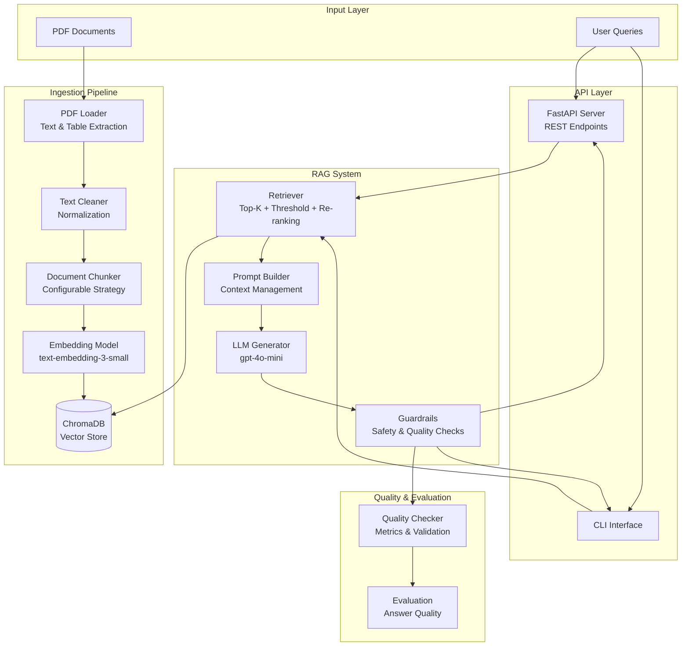
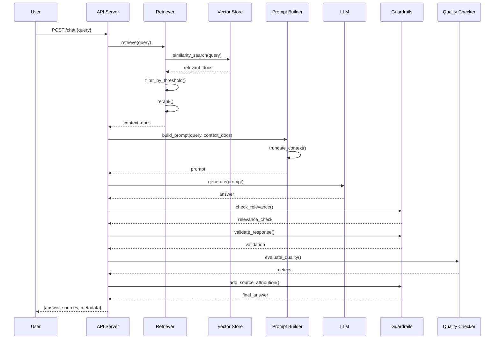

# RAG Lab Tests - Conversational AI Assistant

A production-ready RAG (Retrieval-Augmented Generation) system for answering questions about laboratory test results from PDF documents.

## 🎯 Project Overview

This project implements a "Chat with Your Docs" application that can answer questions about medical laboratory test information from a collection of PDF documents. It demonstrates production-ready AI system engineering with comprehensive RAG implementation, guardrails, quality controls, and testing.

## 🏗️ System Architecture

### Architecture Diagram



### Architecture Overview

The system follows a modular, layered architecture with clear separation of concerns:

#### **Layer 1: Input Layer**
- **PDF Documents**: Source documents stored in `data/` directory
- **User Queries**: Questions submitted via API or CLI

#### **Layer 2: Ingestion Pipeline** (`app/ingestion/`)
- **PDF Loader** (`loader.py`): Extracts text and tables from PDF files
- **Text Cleaner**: Normalizes and cleans extracted text
- **Document Chunker** (`chunker.py`): Splits documents into chunks using configurable strategy
- **Embedding Model**: Converts chunks to vector embeddings
- **Vector Store** (`indexer.py`): Persists embeddings in ChromaDB

#### **Layer 3: RAG System** (`app/rag/`)
- **Retriever** (`retriever.py`): 
  - Retrieves relevant chunks using similarity search
  - Applies similarity threshold filtering
  - Implements re-ranking for better relevance
- **Prompt Builder** (`prompt.py`):
  - Constructs prompts with context
  - Manages token limits and truncation
  - Handles few-shot examples
- **LLM Generator** (`generator.py`):
  - Generates answers using OpenAI GPT models
  - Manages context window
  - Handles streaming responses
- **Guardrails** (`guardrails.py`):
  - Relevance checking
  - Ambiguous query detection
  - Medical emergency detection
  - Source attribution
  - Response validation

#### **Layer 4: API Layer**
- **FastAPI Server** (`api.py`): RESTful API with health checks
- **CLI Interface** (`main.py`): Command-line interface for interactive use

#### **Layer 5: Quality & Evaluation** (`app/eval/`)
- **Quality Checker** (`quality_checks.py`):
  - Answer quality metrics
  - Retrieval quality evaluation
  - Completeness checks

### Data Flow

1. **Ingestion Flow:**
   ```
   PDF → Loader → Cleaner → Chunker → Embeddings → Vector Store
   ```

2. **Query Flow:**
   ```
   User Query → Retriever → Vector Store → Context Documents
   → Prompt Builder → LLM → Guardrails → Quality Check → Response
   ```

### Component Interactions



## 🔧 Technical Architecture & Implementation Decisions

### System Design Principles

1. **Modularity**: Clear separation of concerns with dedicated modules for each component
2. **Configurability**: All key parameters configurable via `app/config.py`
3. **Extensibility**: Easy to add new chunking strategies, retrieval methods, or LLM providers
4. **Testability**: Comprehensive test coverage with unit and integration tests
5. **Production-Ready**: Docker containerization, health checks, error handling

### Component Architecture

#### Ingestion Pipeline Architecture


#### RAG Pipeline Architecture


## 🔧 Implementation Decisions

### Vector Indexing Strategy

**Chunking Approach:**
- **Chunk Size:** 600 characters (configurable in `app/config.py`)
- **Overlap:** 100 characters (configurable)
- **Strategy:** Configurable chunking strategy (default: `recursive_character`)
  - **Recursive Character Splitter:** Hierarchical separators (paragraphs → lines → sentences)
  - **Character Splitter:** Single separator-based splitting
- **Separators:** Configurable list of separators for recursive strategy

**Configuration:**
All chunking parameters are configurable via `app/config.py`:
- `CHUNKING_STRATEGY`: Strategy selection (`recursive_character` or `character`)
- `CHUNK_SIZE`: Target chunk size in characters
- `CHUNK_OVERLAP`: Overlap between chunks
- `CHUNK_SEPARATORS`: List of separators for hierarchical splitting

**Rationale:**
- 600 characters balances context preservation with retrieval precision
- 100-character overlap ensures continuity across chunk boundaries
- Hierarchical separators (paragraphs → lines → sentences) preserve semantic structure
- Table rows are preserved with " | " separator for structured data
- Configurable strategy allows experimentation and optimization for different document types

### Embedding Model & LLM Selection

**Embedding Model:** `text-embedding-3-small`
- **Reasoning:**
  - Cost-effective for production use
  - 1536 dimensions provide good semantic representation
  - Fast inference latency
  - Good performance on medical/technical text

**LLM:** `gpt-4o-mini`
- **Reasoning:**
  - Excellent cost/performance balance
  - Low latency for real-time responses
  - Sufficient context window (128k tokens)
  - Good instruction following
  - Temperature: 0.1 for factual, consistent responses

### Retrieval Approach

**Strategy:**
- **Top-K:** 5 documents (configurable)
- **Similarity Threshold:** 0.6 (filters low-relevance results)
- **Re-ranking:** Enabled (combines similarity + content length)

**Implementation:**
1. Retrieve 2x top_k initially for filtering buffer
2. Convert distance scores to similarity scores
3. Filter by similarity threshold
4. Optional re-ranking: 70% similarity + 30% content length
5. Return top-k most relevant documents

**Rationale:**
- Similarity threshold prevents low-quality context
- Re-ranking improves answer quality by preferring detailed chunks
- Top-k=5 balances context richness with token limits

### Prompt Engineering

**System Prompt:**
- Defines role as medical lab test assistant
- Emphasizes accuracy and source-based answers
- Includes safety disclaimers
- Specifies source attribution requirements

**Context Management:**
- Maximum context tokens: 3000
- Token estimation: ~4 characters per token
- Truncation strategy: Prioritize earlier, more relevant chunks
- Source attribution included in prompt

**Few-Shot Examples:**
- Optional few-shot examples for better instruction following
- Examples demonstrate expected answer format and style

### Context Management

**Token Counting:**
- Character-based estimation (1 token ≈ 4 characters)
- Tracks context usage across documents
- Truncates when approaching limits

**Truncation Strategy:**
- Prioritize documents by similarity score
- Include full documents when possible
- Partial document inclusion if meaningful space remains (>100 tokens)
- Metadata flag for truncated documents

### Guardrails

**Implemented Safeguards:**

1. **Relevance Checking:**
   - Minimum similarity score: 0.5
   - Filters irrelevant results
   - Provides fallback responses

2. **Ambiguous Query Detection:**
   - Detects overly short queries
   - Identifies vague patterns ("what", "how", etc.)
   - Suggests query improvements

3. **Medical Emergency Detection:**
   - Keyword-based detection
   - Provides emergency service guidance
   - Emphasizes general information only

4. **Source Attribution:**
   - Automatic source citation
   - Includes document metadata
   - Builds user trust

5. **Response Validation:**
   - Checks answer completeness
   - Detects error patterns
   - Validates disclaimer presence

### Quality Controls

**Evaluation Metrics:**

1. **Answer Quality:**
   - Completeness score (query word coverage)
   - Relevance score (max similarity)
   - Source availability
   - Length appropriateness

2. **Retrieval Quality:**
   - Retrieval rate (retrieved/expected)
   - Average similarity score
   - Min/max similarity range

3. **Overall Score:**
   - Weighted combination of metrics
   - 40% answer quality + 30% completeness + 30% retrieval quality

## 🚀 Getting Started

### Prerequisites

- Python 3.11+
- OpenAI API key
- Docker and Docker Compose (optional)

### Installation

1. **Clone the repository:**
```bash
git clone <repository-url>
cd RAG_Lab_Tests
```

2. **Create virtual environment:**
```bash
python -m venv .venv
source .venv/bin/activate  # On Windows: .venv\Scripts\activate
```

3. **Install dependencies:**
```bash
pip install -r requirements.txt
```

4. **Set up environment variables:**
```bash
# Create .env file
echo "OPENAI_API_KEY=your-api-key-here" > .env
```

### Usage

#### 1. Ingest Documents

```bash
python -m app.main --ingest
```

This will:
- Extract text from PDFs in `data/` directory
- Chunk documents with metadata
- Build and persist ChromaDB vector store

#### 2. Run CLI Chat

```bash
python -m app.main --chat
```

Interactive command-line interface for asking questions.

#### 3. Run API Server

```bash
python -m app.main --api
```

API will be available at `http://localhost:8000`

**API Endpoints:**
- `GET /health` - Health check
- `POST /chat` - Chat endpoint
- `GET /docs` - API documentation (Swagger UI)

**Example API Request:**
```bash
curl -X POST "http://localhost:8000/chat" \
  -H "Content-Type: application/json" \
  -d '{"query": "What is normal cholesterol?", "top_k": 5}'
```

#### 4. Docker Deployment

```bash
# Build and run with docker-compose
docker-compose up --build

# Or build manually
docker build -t rag-lab-tests .
docker run -p 8000:8000 --env-file .env rag-lab-tests
```

## 🧪 Testing

### Run Tests

```bash
# Run all tests
pytest

# Run with coverage
pytest --cov=app --cov-report=html

# Run specific test file
pytest tests/test_retriever.py

# Run integration tests (requires vector store)
pytest tests/test_integration.py
```

### Test Coverage

- **Unit Tests:** Retriever, guardrails, quality checks
- **Integration Tests:** End-to-end retrieval and generation
- **API Tests:** Health checks and chat endpoints

### Technology Stack


### Deployment Architecture


### Data Flow Architecture

**Ingestion Flow:**
```
PDF Documents → Loader → Cleaner → Chunker → Embeddings → Vector Store
     ↓            ↓         ↓         ↓          ↓            ↓
  [data/]    [extract]  [normalize] [split]  [encode]    [persist]
```

**Query Flow:**
```
User Query → API/CLI → Retriever → Vector Store → Context
     ↓          ↓          ↓            ↓            ↓
  [input]   [receive]  [search]    [retrieve]   [filter]
     ↓
  Prompt Builder → LLM → Guardrails → Quality Check → Response
     ↓              ↓         ↓            ↓            ↓
  [construct]   [generate] [validate]  [evaluate]   [return]
```

## 📁 Project Structure

```
RAG_Lab_Tests/
├── app/
│   ├── ingestion/
│   │   ├── loader.py          # PDF extraction
│   │   ├── chunker.py          # Document chunking
│   │   └── indexer.py          # Vector store indexing
│   ├── rag/
│   │   ├── retriever.py        # Document retrieval
│   │   ├── generator.py        # LLM generation
│   │   ├── prompt.py           # Prompt engineering
│   │   └── guardrails.py       # Safety guardrails
│   ├── eval/
│   │   └── quality_checks.py   # Quality evaluation
│   ├── api.py                  # FastAPI application
│   ├── main.py                 # CLI entry point
│   └── config.py               # Configuration
├── data/                       # PDF documents
├── chroma_db/                  # Vector store (generated)
├── tests/                      # Test suite
├── Dockerfile
├── docker-compose.yml
├── requirements.txt
└── README.md
```

## 🔒 Environment Variables

- `OPENAI_API_KEY` - Required for OpenAI API access

## 📊 Performance Considerations

- **Embedding Model:** Fast inference, cost-effective
- **LLM:** Optimized for latency and cost
- **Chunking:** Balanced for retrieval precision and context
- **Caching:** Vector store persisted for fast startup
- **Token Management:** Efficient context truncation

## 🛡️ Safety & Ethics

- Medical information disclaimers
- Emergency detection and guidance
- Source attribution for transparency
- No medical advice beyond document content
- Clear limitations communication

## 📝 Future Enhancements

- [ ] Streaming responses for better UX
- [ ] Multi-modal support (images, tables)
- [ ] Advanced re-ranking models
- [ ] Conversation memory/history
- [ ] User feedback collection
- [ ] A/B testing framework
- [ ] Monitoring and observability

## 👥 Contributors

Jaisri S
